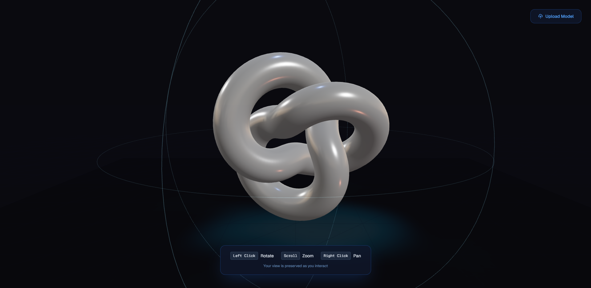

# Interactive 3D Model

An immersive, interactive **3D model viewer** built with **Next.js**, **React Three Fiber**, and **Framer Motion**.
It features floating animations, dynamic lighting, user model uploads (`.glb` / `.gltf`), and a sleek cyber-themed UI with smooth motion effects.


---

## Features

* **Real-time 3D Rendering** with [@react-three/fiber](https://github.com/pmndrs/react-three-fiber) and [@react-three/drei](https://github.com/pmndrs/drei)
* Dynamic **space-themed environment**
* Subtle **floating & rotation animations**
* Custom **starfield background**
* Interactive **orbit controls** (Rotate / Zoom / Pan)
* Upload custom `.glb` / `.gltf` **3D models**
* Smooth **model scaling** on hover
* Animated **Framer Motion** UI transitions
* **Intuitive controls** with on-screen instructions

---


## Tech Stack

| Category   | Library / Framework                                                                      |
| ---------- | ---------------------------------------------------------------------------------------- |
| Framework  | [Next.js 14+](https://nextjs.org/)                                                       |
| 3D Engine  | [React Three Fiber](https://docs.pmnd.rs/react-three-fiber/getting-started/introduction) |
| 3D Helpers | [@react-three/drei](https://github.com/pmndrs/drei)                                      |
| Animations | [Framer Motion](https://www.framer.com/motion/)                                          |
| UI Styling | [Tailwind CSS](https://tailwindcss.com/)                                                 |
| 3D Assets  | GLTF / GLB models                                                                        |

---

## Installation & Setup

### Clone the repo

```bash
git clone https://github.com/20bcs9772/3d-model.git
cd 3d-model
```

### Install dependencies

```bash
pnpm install
```

### Run the development server

```bash
pnpm run dev
```

Visit [http://localhost:3000](http://localhost:3000)

---


## Model Upload

You can upload your own `.glb` or `.gltf` files directly in the browser via the **Upload Model** button.

* Supported formats: `.glb`, `.gltf`
* Model loads asynchronously with a smooth animation
* You can reset the uploaded model anytime

---

## Controls

| Action | Mouse Input            |
| ------ | ---------------------- |
| Rotate | **Left Click + Drag**  |
| Zoom   | **Scroll Wheel**       |
| Pan    | **Right Click + Drag** |

---

## Customization

You can easily tweak:

* Lighting intensity and colors inside `SpaceEnvironment`
* Floating animation speed in `FloatingAnimation`
* Star density in `Stars`
* UI color accents in Tailwind classes
* Shadow and environment settings for your desired mood

---

